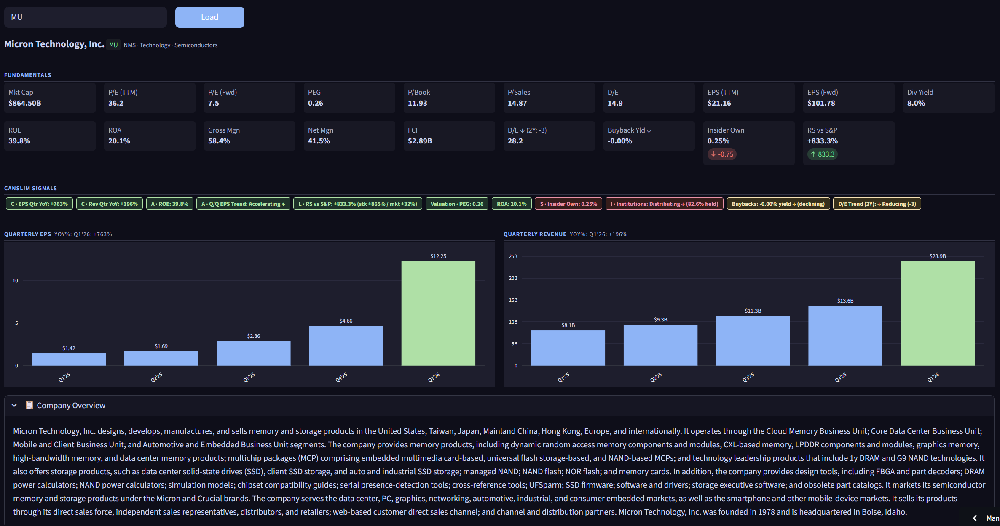

# CANSLIM Dashboard

A real-time stock fundamentals dashboard built around William O'Neil's **CANSLIM** investing methodology. Enter any ticker and instantly see whether it meets the criteria that historically define market-leading growth stocks.

**Live demo:** [canslim-dashboard.streamlit.app](https://canslim-dashboard.streamlit.app)



---

## What is CANSLIM?

CANSLIM is a growth-stock selection framework developed by investor William O'Neil. Each letter maps to a specific fundamental or technical criterion:

| Letter | Stands For | What It Measures |
|--------|-----------|-----------------|
| **C** | Current Earnings | Recent quarterly EPS and revenue growth (YoY) |
| **A** | Annual Earnings | ROE ≥ 17%, multi-year EPS acceleration trend |
| **N** | New Product/Price | Proxied by PEG ratio (growth at a reasonable price) |
| **S** | Supply & Demand | Insider ownership, share buybacks |
| **L** | Leader or Laggard | Relative strength vs. the S&P 500 over 12 months |
| **I** | Institutional Sponsorship | Whether institutions are accumulating or distributing |
| **M** | Market Direction | Macro context (user-assessed) |

---

## Features

### Fundamental Metrics (Row 1 & 2)
- Market Cap, P/E (TTM & Forward), PEG, P/Book, P/Sales
- EPS (TTM & Forward), Dividend Yield
- ROE, ROA, Gross Margin, Net Margin, Free Cash Flow
- Debt/Equity with multi-year trend and direction arrow
- Buyback Yield with trend (growing / flat / declining / net issuance)
- Insider Ownership %
- Relative Strength vs. S&P 500 (12-month price return delta)

### CANSLIM Signal Badges
Color-coded badges (green / yellow / red) for each CANSLIM criterion:
- **C** — Quarterly EPS YoY% and Revenue YoY%
- **A** — ROE vs. 17% threshold; YoY EPS acceleration; Q/Q EPS trend (weighted regression)
- **L** — RS rating showing stock return vs. market return
- **S** — Insider ownership and buyback yield/trend
- **I** — Institutional accumulation vs. distribution (from 13F filing data)
- **Valuation** — PEG and ROA quality checks
- **D/E Trend** — Leverage direction over 2–5 years

### Charts
- **Quarterly EPS** bar chart with most-recent YoY% in title
- **Quarterly Revenue** bar chart with most-recent YoY% in title
- Most recent quarter highlighted in green; prior quarters in blue

### Company Overview
Collapsible section showing the Yahoo Finance business description.

---

## CANSLIM Signal Logic

### Q/Q EPS Trend (Acceleration)
Uses **weighted linear regression** across the last 4 QoQ growth rates, with exponential weights (`[1, 2, 4, 8]`) so the most recent quarter dominates. A single interior dip in an otherwise accelerating trend won't flip the signal to "Decelerating."

### Relative Strength
Compares the stock's 12-month price return against the S&P 500 (`^GSPC`) over the same period. Positive delta = outperforming the market.

### Institutional Signal
Aggregates `pctChange` from the top institutional holders' 13F filings (via yfinance). If ≥55% of holders increased their position → **Accumulating**; ≤40% → **Distributing**; otherwise **Mixed**. Filters out new positions (>50% change) to avoid distortion.

### Buyback Yield
Net buybacks = Repurchases minus new share issuances, divided by market cap. Trend compares the most recent 2-year average against prior years.

---

## Tech Stack

| Tool | Purpose |
|------|---------|
| [Streamlit](https://streamlit.io) | Web app framework |
| [yfinance](https://github.com/ranaroussi/yfinance) | Yahoo Finance data (free) |
| [Plotly](https://plotly.com/python/) | Interactive charts |
| [pandas](https://pandas.pydata.org/) | Data wrangling |

---

## Running Locally

```bash
# Clone the repo
git clone https://github.com/luisruiz38/canslim-dashboard.git
cd canslim-dashboard

# Install dependencies
pip install -r requirements.txt

# Run
streamlit run stock_dashboard.py
```

The dashboard works out of the box — no API keys required. All data is pulled from Yahoo Finance via `yfinance`.

---

## Project Structure

```
canslim-dashboard/
├── stock_dashboard.py      # Main app
├── requirements.txt        # Python dependencies
├── run_dashboard.bat       # Windows launcher shortcut
└── .streamlit/
    └── config.toml         # Dark theme configuration
```

---

## Data Sources & Limitations

- All fundamental data is sourced from **Yahoo Finance** via the `yfinance` library
- Quarterly data is typically limited to the **last 4–5 quarters** (Yahoo Finance API constraint)
- Institutional ownership data reflects **13F filings**, which are reported with a ~45-day lag
- This tool is for **research and educational purposes only** — not investment advice
